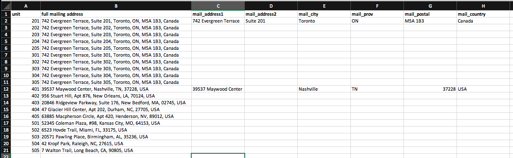
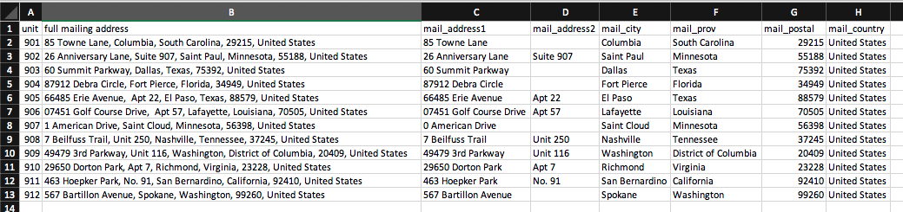

# Test #1 - Address Formatting Test

In this test, you are tasked with breaking out a long address string (Column B) into multiple columns of the individual address parts (Columns C to H). See example image below.

## Instructions

Click here to download the [address formatting test.xlsx](address_formatting_test.xlsx?raw=true) spreadsheet and open it in Excel. You'll see something that looks like the image below.

You'll see that the data in Column B contains a full mailing address.

**Your job is to break out the individual address parts (eg. street, city, postal, etc.) into the corresponding columns (C to H).**

There are two examples, so just follow along with this. The resulting file should look similar to the following when you're done.

Save the updated file and email it to us

### Hints and notes to help you out

- Sort the data and look for patterns
- The `mail_address2` column is optional, some of the USA entries may not have a `mail_address2` and that's OK!
- Do a quick Google on how to handle delimiters with Excel

## What are we testing for?

When we onboard a customer, we must first load in the data for their voters into our system. The "customer data" is typically sent to us in a spreadsheet format (`xlsx`, or `csv`). However, the customer data is usually not in a format that our system can understand. In order for our system to understand the customer data, it needs to be formatted in a way that our software can interpret.

We call the process of reformatting customer data as **"data cleaning"**.

## The next test

Be sure to complete [Test #2](../2_fee_lookup) before sending us an email.
