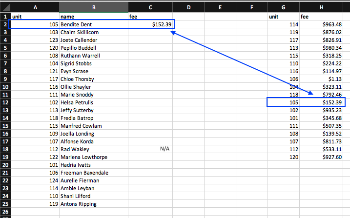
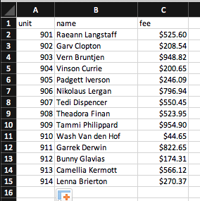

# Test #1 - Address Formatting Test

In this test, you are tasked with matching data between two lists.

## Instructions

Click here to download the [fee_lookup_teset.xlsx](fee_lookup_test.xlsx?raw=true) spreadsheet and open it in Excel. You'll see something that looks like the image below.

You'll see two lists - the first list contains `unit`, `name` and empty `fee` entries. The second list contains `unit` and `fee`.

**Your job is to add the missing `fee` data to the first list using the matching data from the second list.**

- Match on the `unit` columns.
- You don't need to do anything with the `name` column at this time
- If you cannot find a matching `fee` for a `unit` entry, then put `"N/A"` in that entry's `fee` column

To help you out, there's an example match already made in the spreadsheet. When you're done, you'll have a spreadsheet that looks like the image below.

Save the updated file and email it to us

### Hints and notes to help you out

- Consider sorting each list first
- Do a quick Google search on how to use Excel's lookup features

## Send the completed tests back to us

Send an email with all the completed test files attached to:

- **to:** careers[AT]getquorum.com (replace the [AT] with @)
- **subject:** "Completed Tests for [Your Name] (replace [Your Name] with your name)"

## What are we testing for?

One of our core services is to distribute "personalized letters" to our customer's voters. We often receive multiple spreadsheets, each one containing partial amounts of data. We need to "merge" the data so that we have a complete data set.

We call this process of merging customer data **"data merging"**.
