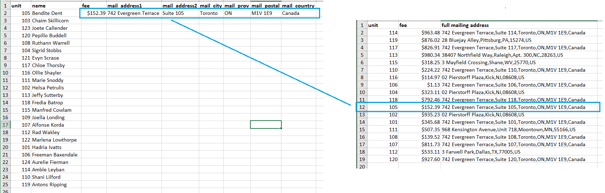
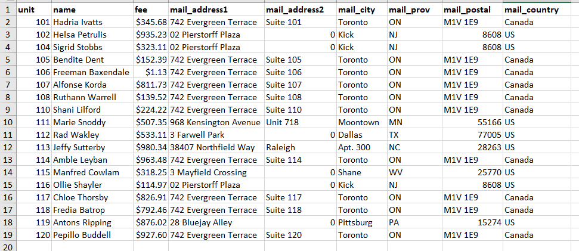

# Test #3 - The In-person Test

In this test you will be tasked with matching data between lists and breaking out long strings. It's a combination of the concepts from Tests 1 and 2. 

This test will be conducted in person at our offices. We'll provide you with the test file, a laptop, and ample time to complete the test. Don't worry, you'll be able to use the internet to find answers if needed. We'll also be in the room with you while you're doing the test to answer questions and guide you through it if you get stuck. 

If you aced the two previous tests then this one will be quick.

## Instructions

To help you prepare for the test the image below shows you an example of the file you'll receive.

The file will once again contain two lists. The first list will have `unit`, `name`, and missing `fee` & `mailing address` information.  The second list will contain the matching `fee` and `address` information.

### Your job will be to...

- add the missing `fee` and `mailing address` data to the first list using the matching data from the second list. 
- break out the `mailing address` data into it's individual address parts.
- sort the results and remove entries that don't have matching data

The image below is an example of what the final results would look like.

### Hints and notes to help you prepare

- If you've completed the previous two tests then you're 90% of the way there
- Look into the `(Advanced)` hints from the previous two tests
- Look into how to **sort** and **filter** data using Excel
- Like, really, make sure you actually do the previous tests yourself.

## What are we testing for?

This test is a simplified example of the type of work you'll be doing at GetQuorum on a regular basis. Our customers provide us with multiple data files during the onboarding process. One of your responsibilities will be to **clean** and **merge** the data into a format that our system can accept.

_Disclaimer: All data used in this test was mocked using a random data generator. Any relation to real world data would be by pure coincidence_
